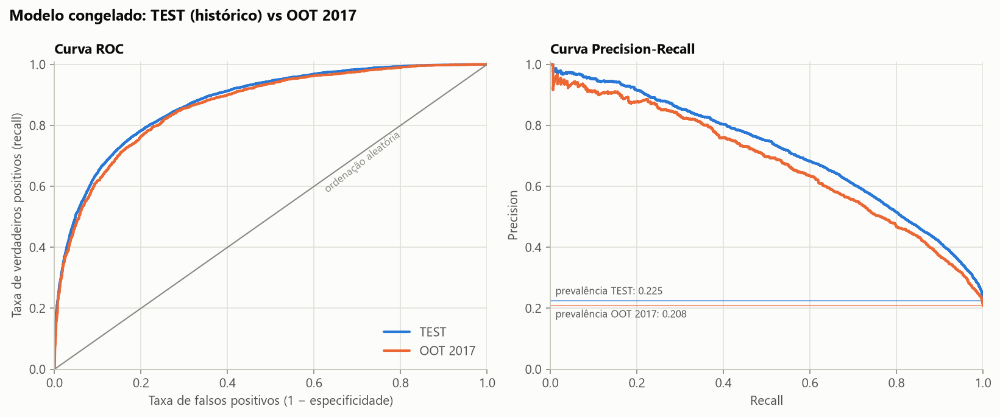
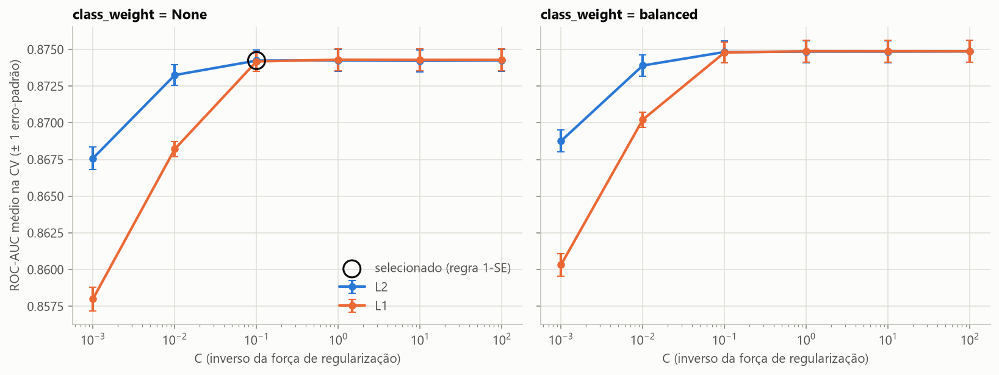
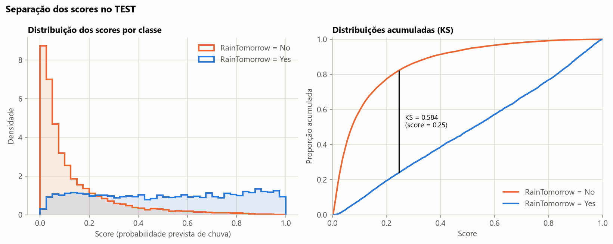
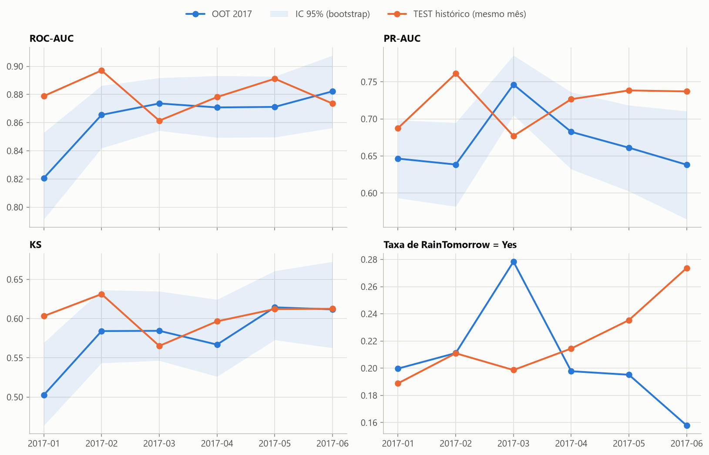
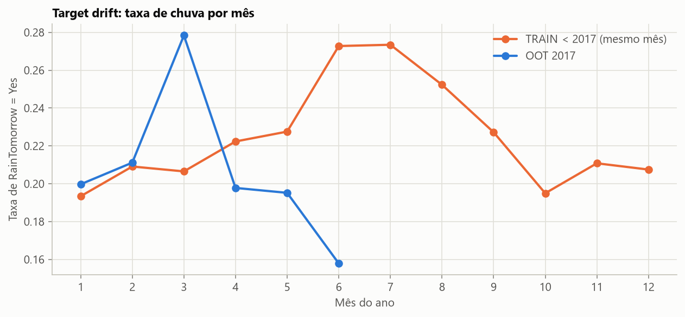
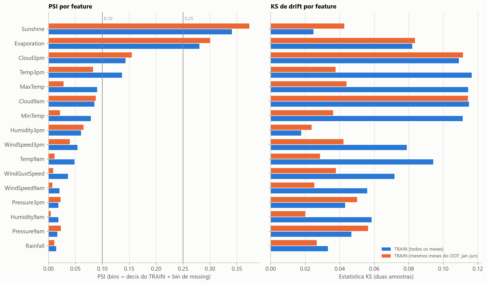

# Rain Tomorrow — classificação binária e estabilidade temporal

Projeto 04 da Mentoria em Ciência de Dados. Estimar a probabilidade de chover no dia seguinte (`RainTomorrow = Yes`) com
**Regressão Logística** e responder à pergunta central:

> *Um modelo de Regressão Logística desenvolvido com dados meteorológicos históricos mantém sua capacidade de discriminar chuva e
> não chuva quando aplicado a um período futuro?*

**Resposta curta: sim, com uma perda pequena a moderada.** No período futuro (Out-of-Time, jan–jun/2017) o ROC-AUC foi 0,865,
contra 0,876 no teste do histórico. A PR-AUC caiu mais (0,714 → 0,674), em boa parte porque 2017 choveu menos. A perda se concentra
em janeiro/2017, e a principal mudança não sazonal nos dados foi de **fornecimento**: várias estações deixaram de medir `Sunshine` e
`Evaporation`.

## Comparação final

| Conjunto / período | ROC-AUC | PR-AUC | KS | Observação |
|---|---|---|---|---|
| Teste | 0,8757 | 0,7138 | 0,5839 | 20% aleatório estratificado do histórico < 2017; 26.746 dias; prevalência 0,225 |
| OOT 2017 | 0,8653 | 0,6740 | 0,5682 | todas as linhas de jan–jun/2017 com alvo; 8.466 dias; prevalência 0,208 |
| Melhor mês do OOT (2017-06) | 0,8822 | 0,6382 | 0,6118 | maior ROC-AUC; mês parcial (25 dias) e o mais seco (15,8%) → PR-AUC baixa |
| Pior mês do OOT (2017-01) | 0,8207 | 0,6465 | 0,5027 | menor ROC-AUC; abaixo do janeiro histórico do teste (0,879) |

Critério de melhor/pior mês, fixado antes de abrir o OOT: ROC-AUC entre meses com ≥ 200 linhas e ≥ 30 casos de cada classe (os seis
meses se qualificaram). Fonte: `artifacts/metrics.json` (`final_comparison`).



---

## 1. Problema e dados

- **Dataset:** Kaggle *Rain in Australia* (`weatherAUS.csv`, Version 2), observações diárias do Australian Bureau of Meteorology (BoM)
  compiladas pelo projeto Rattle. Como obter e conferir o arquivo: [`data/README.md`](data/README.md).
- **Uma linha** = uma estação (`Location`, 49 no total) em um dia (`Date`, 2007-11-01 a 2017-06-25); 145.460 linhas × 23 colunas.
  Esta versão não tem `RISK_MM`.
- **Alvo `RainTomorrow`** (classe positiva = `Yes`): verificado nos dados, `RainTomorrow(t) = RainToday(t+1)` e
  `RainToday = Rainfall > 1 mm`. Como a chuva do dia é medida "nas 24h até as 9h", o alvo é a **chuva > 1 mm entre 09:00 de *t* e
  09:00 de *t+1***.
- **Desbalanceamento:** 22,5% de dias com chuva no histórico. Responder sempre "No" já dá accuracy de ~0,775, por isso accuracy não é
  usada para comparar modelos.

## 2. Estratégia de dados

```
2007-11 ─────────────────────────── 2016-12 | 2017-01 ── 2017-06-25
          DESENVOLVIMENTO (136.837 linhas)   |   OOT 2017 (8.623 linhas)
   − 3.110 sem alvo → 133.727 rotuladas      |   − 157 sem alvo → 8.466 avaliadas
   ├── TRAIN 80% (106.981)  → CV 5-fold, fit |   aberto só depois do congelamento
   └── TEST  20% (26.746)   → avaliação      |
```

- O OOT (todas as linhas de 2017) foi separado **antes de qualquer ajuste**. Antes do congelamento, só se leram contagens estruturais
  de 2017 (linhas, localidades, meses).
- Split aleatório 80/20 com `stratify=y` e `random_state=42`. Escolhi 80/20 porque, com ~134 mil linhas, 20% já dá um teste com ~6 mil
  dias de chuva, e a seleção de hiperparâmetros é feita por CV dentro do TRAIN, sem usar o TEST.
- Linhas sem `RainTomorrow` (dia seguinte sem medição de chuva) são excluídas de treino e métricas; `predict.py` pontua qualquer linha.

## 3. Informação disponível e features

A previsão é tratada como **emitida ao fim do dia *t*** (00:00 de *t+1*). Janelas de medição conforme as notas do BoM
(*Notes to accompany Daily Weather Observations*):

| Fecha até 09:00 de *t* | Fecha até 00:00 de *t+1* | Fecha só às 09:00 de *t+1* |
|---|---|---|
| `MinTemp`, `Rainfall`, `RainToday`, `Evaporation`, leituras das 9h | leituras das 15h, `Sunshine`, `WindGustDir/Speed` | `MaxTemp` (= janela do alvo) |

- **Modelo final com 20 features brutas:** 15 numéricas (`MinTemp`, `Rainfall`, `Evaporation`, `Sunshine`, `WindGustSpeed`,
  `WindSpeed9am`, `WindSpeed3pm`, `Humidity9am`, `Humidity3pm`, `Pressure9am`, `Pressure3pm`, `Cloud9am`, `Cloud3pm`, `Temp9am`,
  `Temp3pm`) + 5 categóricas (`Location`, `WindGustDir`, `WindDir9am`, `WindDir3pm`, `RainToday`) + seno/cosseno do dia do ano.
- **`MaxTemp` foi excluída:** sua janela termina às 09:00 de *t+1*, depois do momento da previsão; nos dados, a temperatura das 9h do
  dia seguinte supera o `MaxTemp` do dia em só 0,0037% dos pares, confirmando a janela. Na CV, excluí-la custa 0,0002 de ROC-AUC.
- **Sem `year`** (2017 estaria fora do suporte do treino) e sem nenhuma feature construída com dias futuros.

**Análise de sensibilidade** (informativa; mesma configuração congelada, só muda o conjunto de features; nunca avaliada no OOT):

| Conjunto | Features | ROC-AUC CV | PR-AUC CV | KS CV | ROC-AUC TEST |
|---|---|---|---|---|---|
| **final** (fim do dia *t*, sem `MaxTemp`) | 20 | 0,8742 | 0,7083 | 0,5830 | 0,8757 |
| com `MaxTemp` | 21 | 0,8744 | 0,7089 | 0,5830 | 0,8756 |
| só o que existe às 09:00 de *t* | 11 | 0,8117 | 0,5684 | 0,4731 | 0,8159 |

Boa parte do sinal vem das observações da tarde, que caem dentro da janela do alvo: o problema, como definido no dataset, é em parte
*nowcasting*.

## 4. Preprocessing

Um único `Pipeline` (`ColumnTransformer` + `LogisticRegression`), ajustado **só no TRAIN** (e, na CV, só em cada fold de treino):

- numéricas → `SimpleImputer(median)` + **indicadores de missing** → `StandardScaler`
  (a ausência de `Sunshine`, `Evaporation`, `Cloud*` e `Pressure*` é estrutural por estação; só 42% das linhas estão completas);
- categóricas → imputação constante `"missing"` → `OneHotEncoder(handle_unknown="ignore")`
  (direção do vento ausente ≈ calmaria: toda leitura de vento 0 km/h não tem direção);
- `Date` → seno e cosseno do dia do ano;
- colunas não listadas (inclusive `RainTomorrow`) são descartadas (`remainder="drop"`).

## 5. Regressão Logística e seleção

Protocolo **pré-registrado** em `src/config.py`, aplicado só com CV estratificada 5-fold no TRAIN (135 ajustes):

- **Métrica de seleção: ROC-AUC médio.** A pergunta central é sobre discriminar chuva de não chuva, e a ROC-AUC mede exatamente a
  ordenação, sem depender da prevalência.
- **Regra de 1 erro-padrão:** entre os candidatos a até 1 EP do melhor, fica o primeiro na ordem de preferência (preprocessing mais
  simples; `class_weight=None`, menor C, L2 antes de L1).
- Estágio 1 (preprocessing): `base` 0,8731 → **`indicators` 0,8743** → `indicators_log` 0,8749 (dentro de 1 EP; fica o mais simples).
- Estágio 2: C ∈ {0,001 … 100} × L1/L2 × `class_weight` ∈ {None, balanced}. Para C ≥ 0,1 o ROC-AUC é praticamente constante
  (0,8742–0,8749); `balanced` ganha ~0,0006 de ROC-AUC mas perde ~0,0035 de PR-AUC e desloca as probabilidades.
- **Escolhido e congelado:** `indicators`, **C = 0,1, L2** (`l1_ratio=0`, `lbfgs`), **`class_weight=None`**; ROC-AUC CV 0,8742
  (EP 0,0007). No scikit-learn 1.9, `penalty` está obsoleto; o tipo de penalização é dado por `l1_ratio` (0 = L2, 1 = L1).



## 6. Resultados no TEST (registrados antes de abrir o OOT)

| | ROC-AUC | PR-AUC | KS |
|---|---|---|---|
| **Modelo final — TEST** | **0,8757** [0,8707–0,8807] | **0,7138** [0,7026–0,7254] | **0,5839** [0,5739–0,5970] |
| Modelo final — TRAIN (in-sample) | 0,8754 | 0,7104 | 0,5846 |
| Baseline (C=1, sem indicadores) — TEST | 0,8751 | 0,7126 | 0,5821 |
| Persistência ("choveu hoje") — TEST | 0,6608 | 0,3410 | 0,3220 |
| Sem habilidade | 0,5 | 0,2252 (prevalência) | 0 |

Intervalos: bootstrap percentil 95%, 1.000 reamostragens. TRAIN ≈ TEST: sem sinal de sobreajuste. No TEST, o score é bem calibrado
(score médio 0,2246 × prevalência 0,2252; notebook, seção 9.2). Com o corte ilustrativo 0,5: precision 0,734, recall 0,523, specificity 0,945, F1 0,611;
com 0,3 o recall sobe para 0,707 e a precision cai para 0,602 (`reports/threshold_examples_test.csv`). **Nenhum threshold foi
escolhido.**



## 7. OOT 2017 (avaliação final do modelo congelado)

| | ROC-AUC | PR-AUC | KS | Prevalência |
|---|---|---|---|---|
| TEST | 0,8757 | 0,7138 | 0,5839 | 0,2252 |
| TEST só jan–jun (referência sazonal)* | 0,8812 [0,8745–0,8878] | 0,7211 | 0,5959 | 0,2206 |
| **OOT 2017** | **0,8653** [0,8553–0,8740] | **0,6740** [0,6509–0,6969] | **0,5682** [0,5506–0,5912] | 0,2082 |
| OOT − TEST | −0,0104 | −0,0398 | −0,0156 | −0,0169 |
| Persistência — OOT | 0,6688 | 0,3325 | 0,3376 | |

\* Calculado no notebook (seção 10), depois da avaliação, só para interpretação.

- **A PR-AUC foi a que mais mudou** (−5,6%, contra −1,2% da ROC-AUC). Parte disso é a prevalência: PR-AUC/prevalência = 3,17 no TEST e
  3,24 no OOT.
- **A sazonalidade não explica a perda:** nos mesmos meses, o TEST tem ROC-AUC 0,881, com intervalo que não se sobrepõe ao do OOT.
- **Tamanho:** a queda de ROC-AUC (0,010) é menor que a variação entre anos do próprio TEST (0,847 a 0,893); 2017 fica acima de 2016.
  Leitura: perda **pequena a moderada** em ROC-AUC/KS e **moderada** em PR-AUC.

## 8. Estabilidade temporal (OOT por mês)

| Mês | Dias | n | Positivos | Taxa de chuva | ROC-AUC [IC95%] | PR-AUC | KS | ROC-AUC TEST mesmo mês |
|---|---|---|---|---|---|---|---|---|
| 2017-01 | 31 | 1.492 | 298 | 0,200 | **0,821** [0,791–0,853] | 0,646 | 0,503 | 0,879 |
| 2017-02 | 28 | 1.345 | 284 | 0,211 | 0,866 [0,842–0,886] | 0,639 | 0,584 | 0,897 |
| 2017-03 | 31 | 1.480 | 412 | 0,278 | 0,874 [0,854–0,892] | 0,746 | 0,584 | 0,861 |
| 2017-04 | 30 | 1.451 | 287 | 0,198 | 0,871 [0,849–0,893] | 0,683 | 0,567 | 0,878 |
| 2017-05 | 31 | 1.501 | 293 | 0,195 | 0,871 [0,850–0,893] | 0,661 | 0,614 | 0,891 |
| 2017-06 | 25 | 1.197 | 189 | 0,158 | **0,882** [0,856–0,908] | 0,638 | 0,612 | 0,874 |

Nenhuma janela ficou abaixo do volume mínimo (≥ 200 linhas e ≥ 30 de cada classe). Fonte: `reports/temporal_performance.csv`.

- **ROC-AUC estável de fevereiro a junho** (0,866–0,882, intervalos sobrepostos); **janeiro destoa** (0,821, abaixo do janeiro histórico
  de 0,879). Não há tendência de queda ao longo do semestre.
- **A PR-AUC oscila mais (0,638–0,746) e acompanha a taxa de chuva:** março, o mês mais chuvoso, tem a maior PR-AUC; junho, o mais seco,
  tem o maior ROC-AUC e uma das menores PR-AUC.
- O score médio mensal acompanhou a taxa de chuva (mar: 0,268 × 0,278; jun: 0,179 × 0,158), sem nenhum ajuste.



## 9. Target drift

| | TRAIN | TEST | OOT 2017 | Esperado para jan–jun* |
|---|---|---|---|---|
| Taxa de `RainTomorrow = Yes` | 0,2252 | 0,2252 | **0,2082** | 0,2204 |

\* Taxa de cada mês no TRAIN ponderada pela composição de meses do OOT.

Por mês, 2017 fugiu do padrão em direções opostas: **março muito mais chuvoso** (27,8% × 20,7% no TRAIN) e **junho muito mais seco**
(15,8% × 27,3%); abril e maio também mais secos; janeiro e fevereiro próximos do histórico (`reports/target_drift.csv`). A menor
prevalência ajuda a explicar a queda e a oscilação da PR-AUC; ROC-AUC e KS não seguem a taxa.



## 10. Feature drift (PSI e KS, TRAIN → OOT)

PSI com bins = decis de cada feature **no TRAIN** + um bin de missing, reaplicados ao OOT; KS de duas amostras nos valores observados.
Duas referências: TRAIN inteiro (o pedido) e TRAIN só jan–jun (mesma estação do OOT). Fonte: `reports/drift_report.csv`.

| Feature | PSI | KS | PSI (ref. jan–jun) | KS (ref. jan–jun) | Missing TRAIN → OOT |
|---|---|---|---|---|---|
| Sunshine | **0,341** | 0,025 | 0,373 | 0,043 | 46% → 74% |
| Evaporation | **0,281** | 0,082 | 0,300 | 0,084 | 41% → 67% |
| Cloud3pm | 0,143 | 0,109 | 0,155 | 0,111 | 39% → 55% |
| Temp3pm | 0,136 | 0,116 | 0,083 | 0,038 | 1,7% → 6,2% |
| MaxTemp (fora do modelo) | 0,091 | 0,114 | 0,028 | 0,044 | 0,2% → 0,9% |
| Cloud9am | 0,085 | 0,115 | 0,088 | 0,114 | 37% → 47% |
| MinTemp | 0,079 | 0,111 | 0,022 | 0,036 | 0,4% → 1,2% |
| Humidity3pm | 0,060 | 0,018 | 0,065 | 0,024 | 2,3% → 6,9% |
| WindSpeed3pm | 0,054 | 0,079 | 0,040 | 0,042 | 1,7% → 4,2% |
| Temp9am | 0,048 | 0,094 | 0,011 | 0,029 | 0,7% → 0,6% |
| WindGustSpeed | 0,036 | 0,072 | 0,009 | 0,038 | 6,6% → 6,3% |
| WindSpeed9am | 0,020 | 0,056 | 0,007 | 0,025 | 1,0% → 0,6% |
| Pressure3pm | 0,019 | 0,043 | 0,022 | 0,050 | 9,8% → 10,3% |
| Humidity9am | 0,018 | 0,058 | 0,004 | 0,020 | 1,3% → 1,5% |
| Pressure9am | 0,017 | 0,047 | 0,023 | 0,056 | 9,9% → 10,3% |
| Rainfall | 0,014 | 0,033 | 0,011 | 0,027 | 1,0% → 1,8% |
| Location (categórica) | 0,025 | — | 0,027 | — | — |
| Score do modelo | 0,010 | 0,027 | 0,009 | 0,025 | — |

- **O PSI alto de `Sunshine` e `Evaporation` vem de dados ausentes, não de valores diferentes:** o KS entre valores observados é
  pequeno. 15 estações deixaram de informar `Sunshine` (a maioria a partir de abril/2016) e 11 deixaram de informar `Evaporation`.
  É mudança no **fornecimento dos dados** (diagnóstico pós-OOT, feito depois da avaliação e só para interpretação: notebook, seção 13.1).
- **Sazonalidade:** com a referência jan–jun, o drift das temperaturas quase desaparece (KS de `Temp3pm` 0,116 → 0,038).
- **Não sazonal:** nuvens (KS ≈ 0,11 nas duas referências), possivelmente por mudança na composição de estações que reportam.
- **O score do modelo quase não mudou** (PSI 0,010). Os cortes de PSI (~0,10/~0,25) foram lidos como heurística, não como regra.



## 11. Respostas às perguntas finais

1. **Score × classe prevista.** O score é `predict_proba[:, 1]` = P(chuva); a classe só existe depois de um threshold. O projeto entrega o
   score (calibrado no TEST: média 0,2246 × prevalência 0,2252).
2. **Accuracy em classe desbalanceada.** "Sempre No" tem accuracy 0,775 e recall 0. O modelo em 0,5 tem accuracy 0,850, mas recall 0,523 —
   a accuracy esconde que quase metade dos dias de chuva não é avisada.
3. **Precision, Recall, Specificity, F1 (TEST, corte 0,5).** Precision 0,734: 73 de cada 100 avisos de chuva se confirmam. Recall 0,523:
   52 de cada 100 dias chuvosos são avisados. Specificity 0,945: 94,5% dos dias secos são reconhecidos. F1 0,611 combina precision e recall;
   todos mudam com o corte.
4. **Métricas sem threshold.** ROC-AUC e PR-AUC resumem as curvas ao longo de todos os cortes; KS é a maior distância entre as distribuições
   acumuladas dos scores das duas classes. As três dependem só da ordenação.
5. **ROC-AUC e PR-AUC contaram a mesma história?** Em parte: as duas caíram no OOT, mas a PR-AUC caiu cerca de quatro vezes mais, porque
   depende da prevalência. Dentro de 2017 divergem: junho tem o maior ROC-AUC e uma das menores PR-AUC.
6. **Por que 0,5 não é o melhor corte.** O corte ótimo depende do custo de alarme falso × chuva não avisada e da prevalência; só 16% dos
   dias do TEST passam de 0,5, e a maior separação (KS) ocorre por volta de 0,25.
7. **Teste aleatório × OOT.** O TEST mistura todos os anos e tem dias vizinhos da mesma estação no TRAIN (otimista); o OOT é um período
   posterior, nunca visto, com mudanças reais. Só o OOT responde à pergunta temporal.
8. **Três vazamentos.** (a) informação do dia seguinte: *lead* de `RainToday`/`Rainfall` (= alvo), `RISK_MM`, ou `MaxTemp` (excluída);
   (b) ajustar imputer/scaler/encoder com TEST ou OOT; (c) olhar 2017 e voltar para mudar features, C ou preprocessing.
9. **Estabilidade em 2017.** ROC-AUC estável de fevereiro a junho (0,866–0,882); janeiro é a exceção (0,821). A PR-AUC oscila com a taxa
   de chuva.
10. **Target drift.** Sim: 0,208 no OOT × 0,225 no histórico (0,220 esperado para jan–jun); março muito chuvoso e junho muito seco.
11. **Maior drift.** PSI: `Sunshine` (0,34) e `Evaporation` (0,28), por dados ausentes. KS: `Temp3pm`, `Cloud9am`, `MinTemp`, `Cloud3pm`
    (~0,11); o das temperaturas desaparece com a referência sazonal, o das nuvens não.
12. **Drift ≠ modelo quebrado.** Parte do drift é sazonal e os maiores PSI vêm de dados ausentes, tratados pelo pipeline; o score quase não
    mudou e o ROC-AUC caiu 0,010, dentro da variação histórica. Há perda real, mas modesta, concentrada em janeiro — motivo para monitorar.
13. **O que `predict.py` faz.** Carrega o pipeline congelado, confere o hash, valida as colunas, aplica o preprocessing aprendido no TRAIN,
    ignora colunas extras e grava a probabilidade por linha, na ordem de entrada, sem treinar nada e sem depender do notebook.

---

## Estrutura do repositório

```
rain_tomorrow/
├── README.md                  # este arquivo
├── CLAUDE.md                  # regras permanentes do projeto (temporalidade, OOT, reprodutibilidade)
├── requirements.txt           # versões fixadas (Python 3.11.9)
├── pytest.ini
├── data/
│   └── README.md              # origem, versão e SHA-256 do weatherAUS.csv (o CSV não é versionado)
├── notebooks/
│   └── 01_exploration_modeling.ipynb   # narrativa: EDA → modelagem → TEST → OOT → estabilidade → drift
├── src/                       # código reutilizado por scripts, testes e notebook
│   ├── config.py              # caminhos, corte temporal, features, janelas de medição, protocolo pré-registrado
│   ├── data.py                # leitura, corte OOT, split 80/20, guardas anti-OOT
│   ├── preprocessing.py       # ColumnTransformer (imputação, escala, one-hot, dia do ano)
│   ├── modeling.py            # pipeline LogisticRegression, CV, regra de 1 erro-padrão
│   ├── metrics.py             # ROC-AUC, PR-AUC, KS, bootstrap, métricas por janela
│   ├── drift.py               # PSI (bins do TRAIN + bin de missing) e KS de drift
│   ├── evaluation.py          # estabilidade mensal, target drift e feature drift do OOT
│   ├── artifacts.py           # salvar/carregar o modelo congelado com verificação de hash
│   └── plots.py               # figuras
├── scripts/
│   ├── train.py               # seleção no TRAIN, ajuste final, métricas de TEST, congelamento
│   ├── evaluate.py            # abre o OOT com o modelo congelado; estabilidade e drift
│   └── predict.py             # inferência em CSV novo
├── artifacts/
│   ├── model.joblib           # pipeline completo (preprocessing + LogisticRegression)
│   ├── metadata.json          # hash, corte, features, janelas, hiperparâmetros, ambiente, registro da avaliação OOT
│   └── metrics.json           # baseline, CV, TRAIN, TEST, OOT, meses, target drift, comparação final
├── reports/
│   ├── cv_results.csv  sensitivity_analysis.csv  coefficients.csv  threshold_examples_test.csv
│   ├── temporal_performance.csv  target_drift.csv  drift_report.csv
│   └── figures/               # figuras usadas aqui e no notebook
└── tests/                     # separação temporal, leakage, métricas, drift, avaliação, inferência, artefatos
```

## Como reproduzir

```bash
python -m venv .venv
.venv\Scripts\activate                     # Windows  (Linux/macOS: source .venv/bin/activate)
python -m pip install -r requirements.txt
```

Se o `pip` falhar com `CERTIFICATE_VERIFY_FAILED` por causa de um antivírus que intercepta HTTPS, passe o certificado dele com
`--cert <arquivo.pem>` em vez de desligar a verificação. Coloque `data/weatherAUS.csv` conforme [`data/README.md`](data/README.md).
Depois, **com o ambiente ativado e nesta ordem**:

```bash
python scripts/train.py        # ~12 min (CV com 135 ajustes); congela artifacts/model.joblib
python scripts/evaluate.py     # abre o OOT 2017 com o modelo congelado
python -m pytest               # testes
python -m jupyter nbconvert --to notebook --execute --inplace --ExecutePreprocessor.timeout=-1 notebooks/01_exploration_modeling.ipynb
```

O notebook reexecuta a seleção (~10 min) e confere com `assert` que chega aos mesmos números dos artefatos. Ative o ambiente antes do
`nbconvert`: o kernel `python3` chama o `python` do PATH.

## Inferência em dados novos

```bash
python scripts/predict.py --input data/new_weather.csv --output predictions.csv
```

- **Entrada:** CSV com `Date` (`AAAA-MM-DD`), `Location` e as 19 variáveis meteorológicas do modelo; valores ausentes são aceitos.
  Colunas extras — inclusive `RainTomorrow` e `MaxTemp` — são ignoradas; falta de coluna obrigatória gera erro com a lista.
- O script carrega `artifacts/model.joblib`, **confere o SHA-256 contra `metadata.json`**, aplica todo o preprocessing salvo e
  **não treina nada**.
- **Saída:** `Date,Location,rain_probability`, na ordem da entrada; `rain_probability` = P(`RainTomorrow = Yes`), sem threshold.
- Localidades ou direções de vento não vistas no TRAIN geram aviso e viram colunas one-hot zeradas.

Exemplo reproduzível com o próprio dataset (a coluna `RainTomorrow` é ignorada):
`python scripts/predict.py --input data/weatherAUS.csv --output predictions.csv`.

## Protocolo temporal (registro)

- Protocolo de seleção, janelas mensais, regra de volume mínimo, critério de melhor/pior mês e bins de PSI fixados antes de abrir 2017.
- Modelo congelado em **2026-09-28T22:41:09Z**, SHA-256 `b274388f39b24a3361f914cd78161d3dcd09fbe96a16273a6ebc2534c67be3ff`.
- Commit `94355a5` (*Freeze final model before OOT evaluation*, 2026-09-28T23:09:34Z) versiona esse modelo com
  `metrics.json` ainda marcado como "OOT não avaliado".
- OOT aberto por `evaluate.py` em **2026-09-28T23:12:29Z**; hash verificado antes e depois (`metadata.json` → `oot_evaluation`).
  Nenhum `fit` roda em `evaluate.py`, `predict.py` ou `src/evaluation.py` (teste automatizado).
- Depois da abertura do OOT, nenhuma feature, hiperparâmetro, threshold ou calibração foi alterado. Mudanças posteriores tocaram só
  documentação e análises exploratórias rotuladas como pós-OOT (TEST jan–jun, diagnóstico de missingness).

## Testes

`python -m pytest` cobre:
- **separação temporal:** OOT = 2017 exato, TRAIN/TEST disjuntos e sem 2017, split reproduzível;
- **leakage:** estatísticas do modelo salvo iguais às do TRAIN e diferentes das de TRAIN+TEST, nenhuma feature de ano/alvo, conjunto final
  fechado até o fim do dia *t*;
- **métricas:** KS = `ks_2samp`, AP, casos-limite, janelas insuficientes;
- **drift:** PSI calculado à mão, bins da referência, bin de missing;
- **avaliação:** análises do OOT e figuras com dados sintéticos;
- **inferência:** `predict.py` em processo separado (ordem, colunas, probabilidades em [0, 1], erro de coluna ausente), modelo adulterado
  rejeitado;
- **artefatos:** hash, regra de seleção reproduzida a partir de `cv_results.csv`, código de treino que nunca lê 2017.

## Limitações e próximos passos

- O OOT cobre um único semestre (jan–jun/2017, junho parcial): não mostra inverno/primavera nem estabilidade de longo prazo.
- O TEST aleatório é otimista (autocorrelação entre dias vizinhos da mesma estação), e os intervalos de bootstrap tratam dias como
  independentes, então tendem a ser estreitos demais.
- O alvo começa às 09:00 do dia da previsão: o problema é em parte *nowcasting* (modelo só com dados das 9h: ROC-AUC 0,812 na CV).
- Chuva e evaporação podem vir acumuladas após dias sem medição (nota do BoM): ruído no alvo e nas features.
- Sazonalidade única para o país inteiro (dia do ano), sem interação com a região; localidades novas entram com one-hot zerado.
- **Próximos passos (novo ciclo de desenvolvimento):** monitorar missingness por estação e métricas por mês; retreinar com dados
  recentes, em especial após a mudança de fornecimento de 2016; avaliar o restante de 2017; se houver uso operacional, escolher o
  threshold a partir de custos explícitos de FP e FN.
